# IMDB Sentiment Analysis

## 📊 Dataset Description
**Source**: [IMDB Dataset of 50K Movie Reviews](https://www.kaggle.com/datasets/lakshmi25npathi/imdb-dataset-of-50k-movie-reviews)

---

## 📈 Visual Exploratory Data Analysis (EDA)

### 1. Distribution of Sentiment Labels
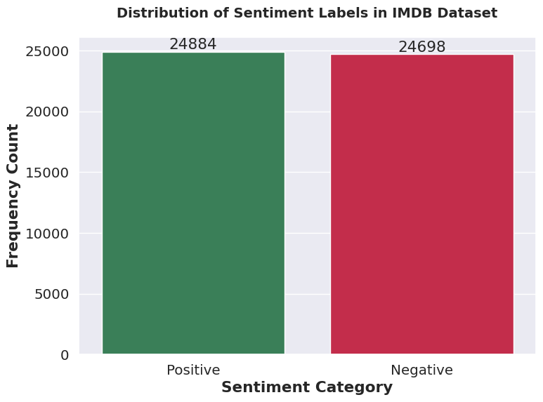

### 2. Most Frequent Terms in Positive Reviews
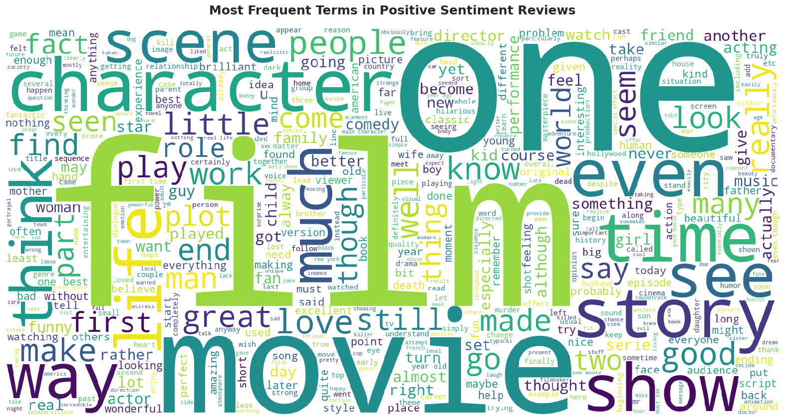

### 3. Dominant Terms in Negative Reviews
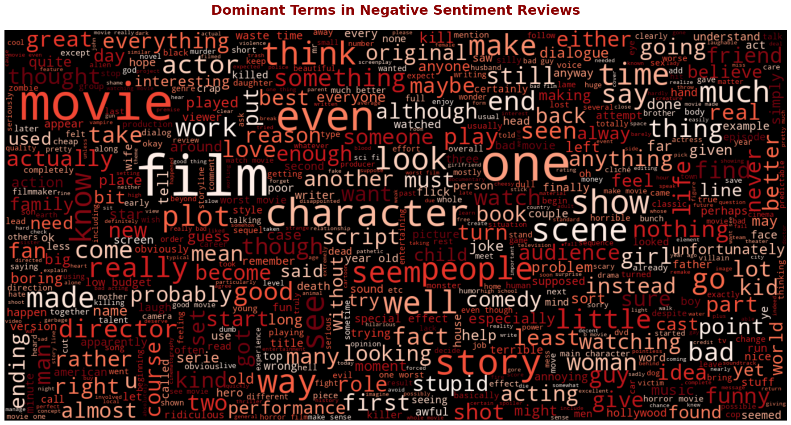

### 4. Character Count Distribution by Sentiment
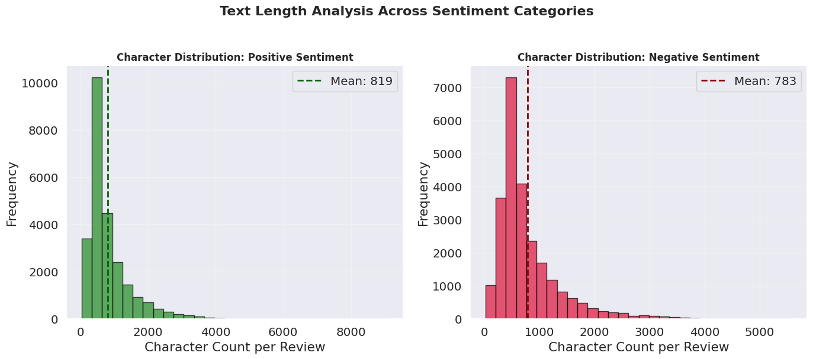

### 5. Word Count Distribution by Sentiment
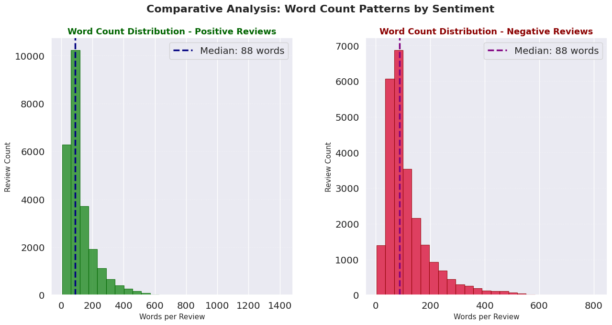

### 6. Statistical Word Count Distribution
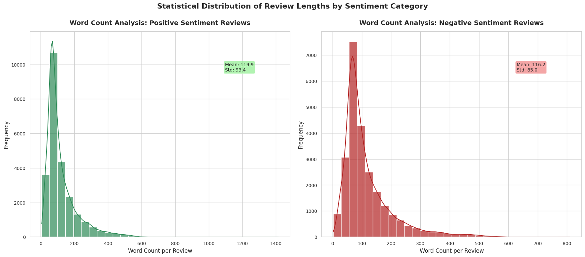

### 7. Average Word Length Distribution
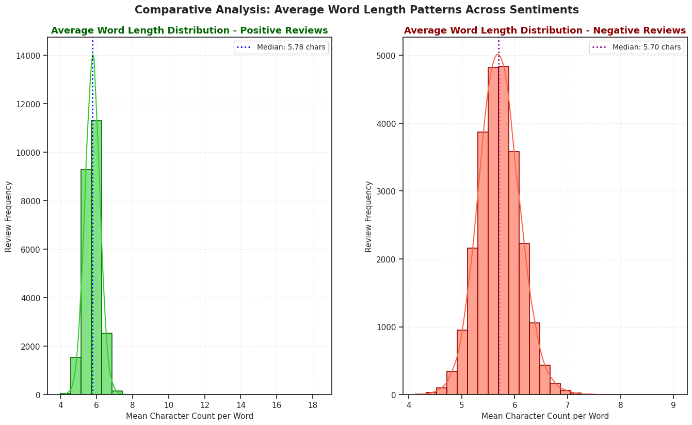

### 8. Top 10 Most Frequent Words
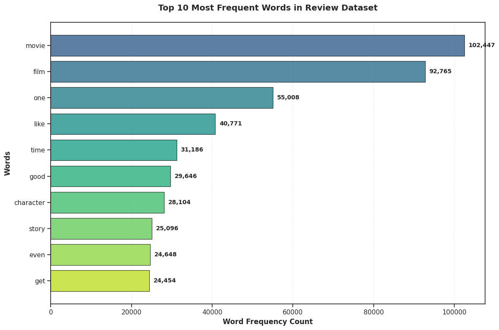

### 9. Word Frequency Comparison (Positive vs Negative)
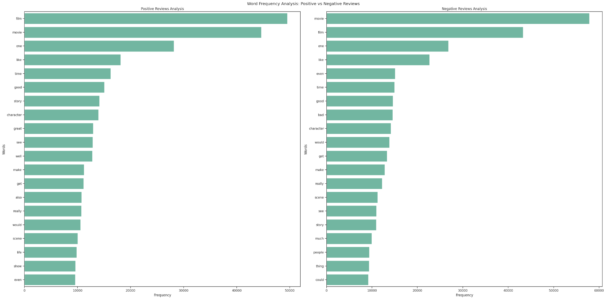

### 10. Bigram Analysis: Positive vs Negative
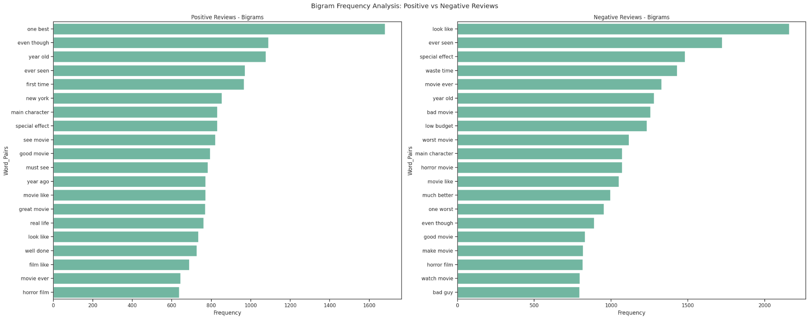

### 11. Trigram Analysis: Positive vs Negative
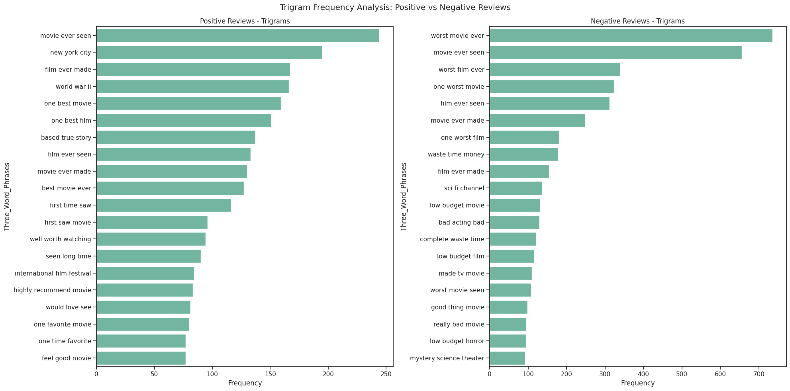

## ✨ Summary
The above analysis gives clear insights into text length patterns, word usage differences, and sentiment-based expression in movie reviews. It provides the groundwork for feature engineering in downstream NLP tasks.
